# 🎛️ SC01 Plus — WipidiM Controller Firmware

<p align="center">
  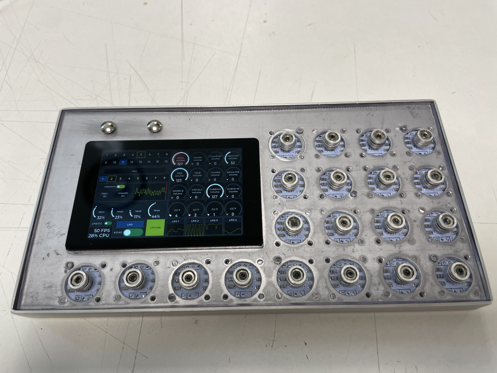
</p>

<p align="center">
High-resolution Bluetooth MIDI controller firmware for the WT32 SC01 Plus platform.<br>
Powered by 20× AS5600 magnetic encoders, LVGL touchscreen UI, BLE MIDI, Web Configuration, and onboard modulation engines.
</p>

---

# ✨ Features

| Feature | Details |
|---|---|
| 20× AS5600 Magnetic Encoders | 3× TCA9548A I2C multiplexers, magnetic (no mechanical wear) |
| WT32 SC01 Plus | ESP32-S3 480×320 touchscreen |
| Touch Buttons | Shift + LFO capacitive touch hardware buttons |
| SD Card Storage | JSON-based auto-save config |
| BLE MIDI | Enabled by default |
| WiFi Web Server | Browser-based live configuration + file manager |
| Vibration Motor | Configurable haptic feedback |
| 8 Pages × 16 Channels × 20 Encoders | 2560 mappable MIDI CC/Note controls |
| 4 Independent LFOs | 6 waveforms + mix mode + modulation routing |
| Chord Engine | 100 chord sets, 11 chord types, progressions, inversions, voicings |
| Keyboard Mode | 19 scales, velocity curves, scale snap |
| Track & Template System | 4 layers × 4 action buttons + 8 template arcs |

---

# 🎛 MIDI Engine

- 8 Pages × 16 MIDI Channels × 20 Encoders = **2560 mappable controls**
- MIDI CC + MIDI Note support
- BLE MIDI + optional USB MIDI
- Per-channel page, row, label, CC# memory
- Real-time MIDI feedback (bi-directional)
- Velocity curves: Linear, Soft, Hard, Fixed
- 4 velocity-scaled keyboard layers (Track System)

Built on the [Control Surface](https://github.com/tttapa/Control-Surface) library.

---

# 🖥 Modes

## 🎚 CC Mode

<p align="center">
  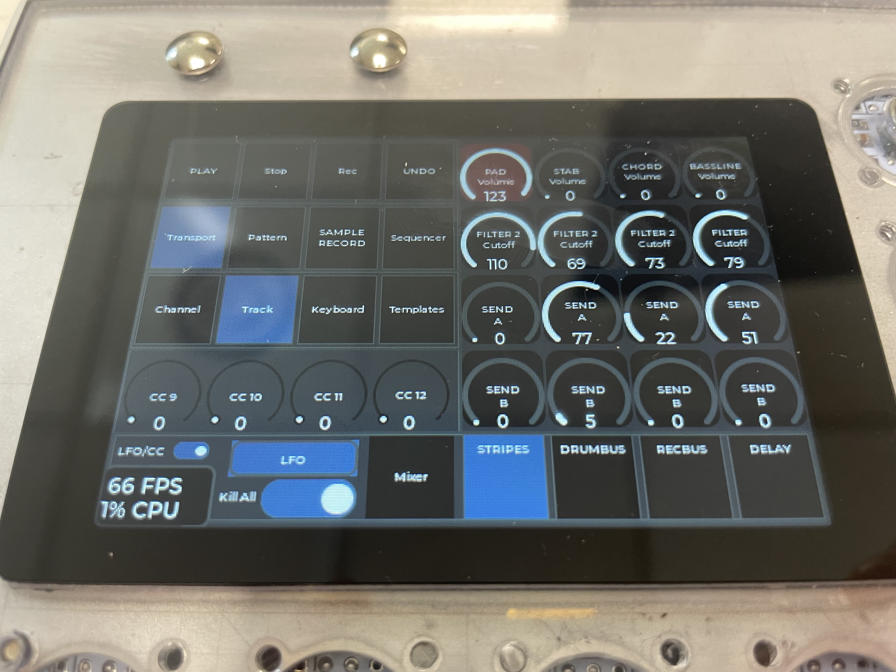
</p>

Per-encoder CC#, channel, label and value editing. 8 pages per channel, 16 channels. Encoder detent and behavior modes.

## 🎛 Mixer Mode

<p align="center">
  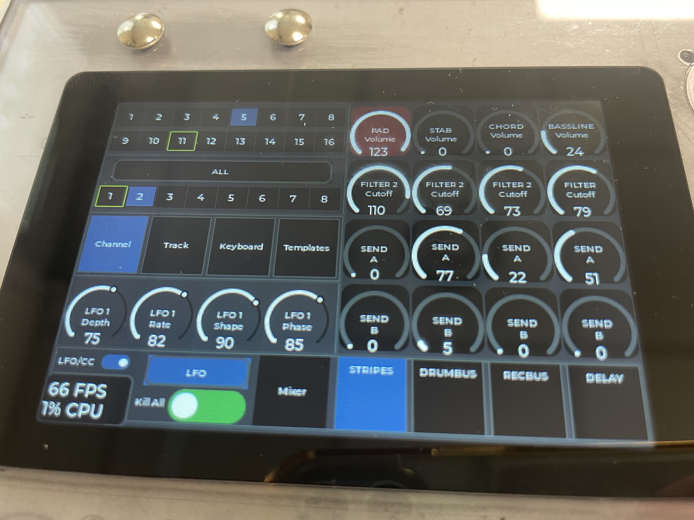
</p>

- 5 custom mixer pages, each with per-page CC mapping and channel assignment
- Momentary (Shift tap) or Latching (Shift hold)
- 5 mixer button labels per page
- 16 mixer volumes

## 🎹 Keyboard Mode

<p align="center">
  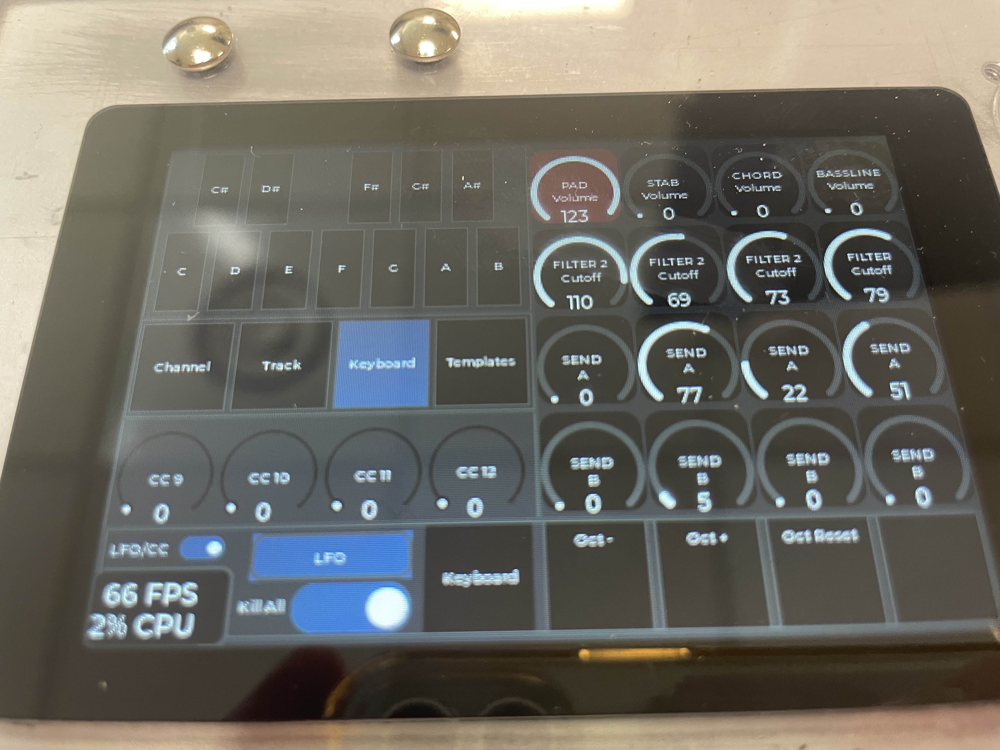
</p>

- Full chromatic on-screen keyboard
- 19 scales with automatic snap-to-scale
- 4 velocity curves
- Mod wheel control
- Chord highlighting
- Note name display

## 🌊 LFO Engine

<p align="center">
  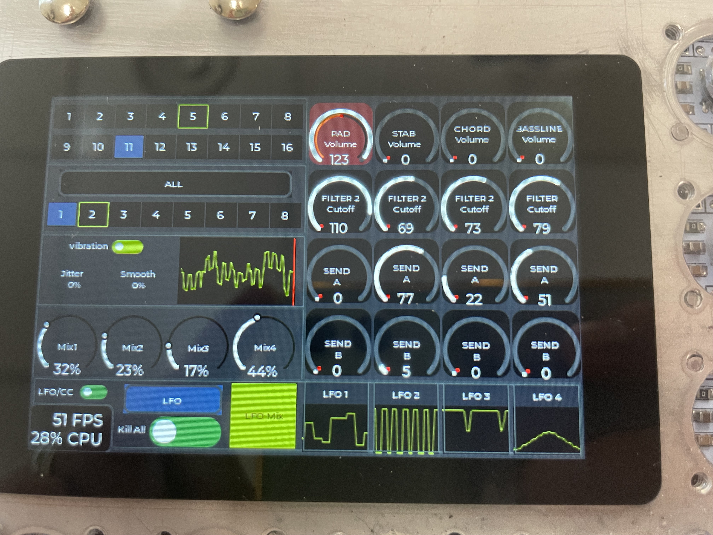
</p>

### 4 Independent LFOs

| Shape | Description |
|---|---|
| Sine | Smooth bipolar modulation |
| Triangle | Linear bipolar sweep |
| Saw Up / Down | Ramp waveforms |
| Square | Binary on/off |
| Random | Smooth random |
| Sample & Hold | Stepped random |

Each LFO: adjustable rate, depth, offset, visual waveform preview.

### Mix Mode
Layer multiple LFOs with individual mix amounts. Main waveform buffer visualization. Kill switch.

### Modulation Routing
Route any LFO to any encoder — real-time modulated MIDI output.

---

# 🎸 Chord Engine

<p align="center">
  
</p>

### 100 Chord Sets
Pop, Jazz, Blues, EDM, House, Techno, Trance, Synthwave, Cinematic, Neo Soul, Funk, Gospel, R&B, Bossa Nova, Classical, Lofi — loaded from SD (`chord_sets.json`), 12 chord pads per set.

### 4 Keyboard Submodes

| Submode | Function |
|---|---|
| Keys | Individual notes with scale constraints |
| Chord | Play 12 chord pads from selected set |
| Chord Type | Build chords from 11 types × inversions × voicings |
| Progression | Step through 6 progression patterns in any root key |

### Chord Configuration
- **11 Chord Types**: Minor Triad, Major 7th, Sus2, Sus4, Diminished, Quartal, Cluster, Add9, Minor 7th, Minor 9th, Power Chord
- **6 Progressions**: The Classic, The Shadow, The Modal, The Workhorse, The Cyclical, The Borrowed
- **Inversions**: Root, 1st, 2nd
- **Voicings**: Close, OctaveSpread, Rootless, Cluster

Held-note management survives octave/voicing/inversion changes.

---

# 📋 Track & Template System

## Track System
- 4 layers × 4 action buttons
- Configurable note-on/note-off or CC per button
- Layer names and per-layer action configuration
- Velocity-scaled note output

## Template System
- 8 template arc notes (MIDI note per encoder)
- Template button notes for pins 12 and 14
- Template button labels

---

# 📱 Menu System

4 touch-driven panels:
- **Channel** — per-channel settings, page nav
- **Track** — track layer actions and labels
- **Keyboard** — scales, velocity curve, mod wheel
- **Templates** — arc notes and button assignments

CC Row Mode: 4 rows × 4 pots for compact CC surface navigation.

---

# 🌐 Web Interface

<p align="center">
  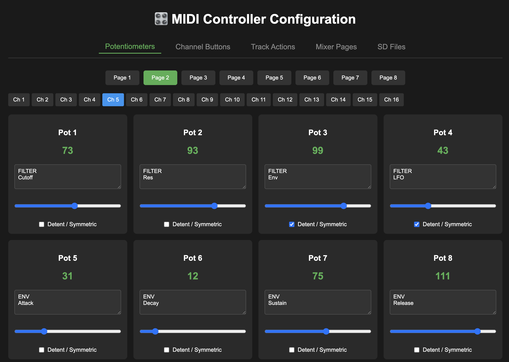
  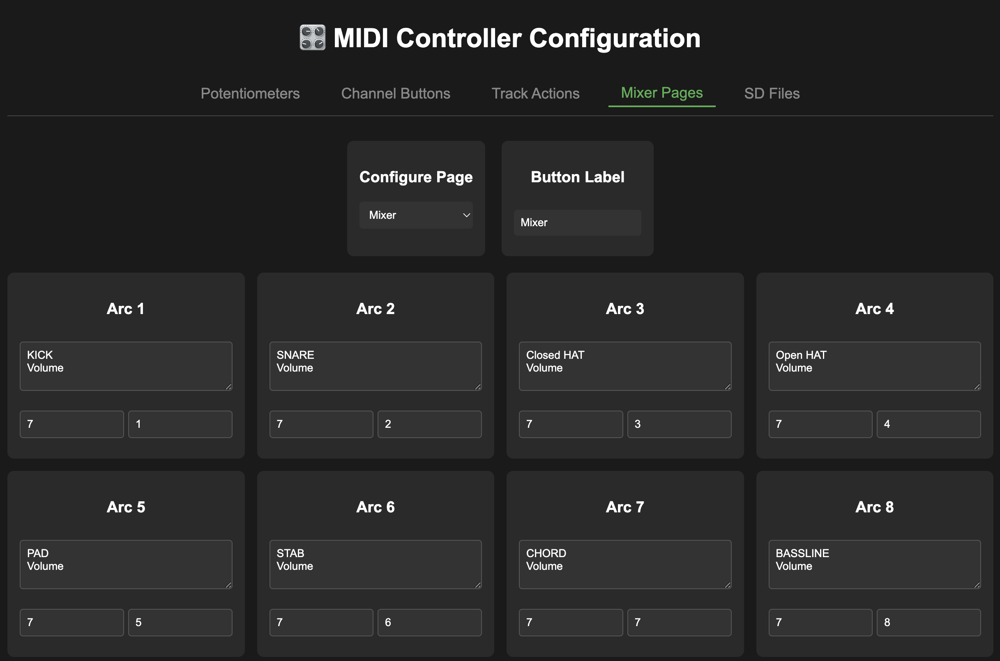
</p>

## Browser-Based Configuration

Built-in WiFi web server with dedicated APIs:

| Endpoint | Function |
|---|---|
| MIDI Config | CC mapping, channels, labels, pot values |
| Mixer Config | Per-page CC/channel assignment |
| Track Actions | Layer button note/CC config |
| Template Actions | Arc notes, button note assignment |
| SD File Manager | List, download, upload, delete files |
| Factory Reset | Wipe all config to defaults |

<p align="center">
  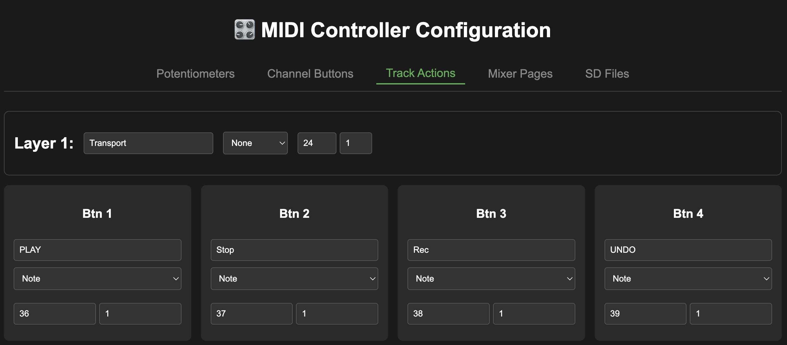
</p>

### Connecting

<p align="center">
  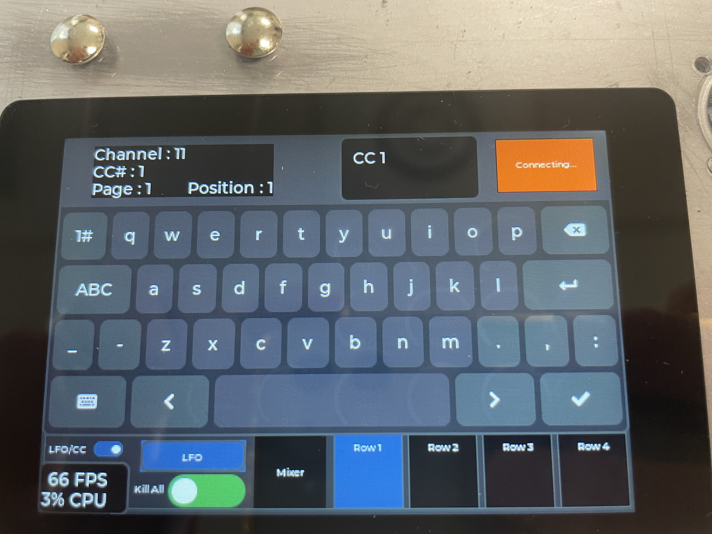
</p>

Tap the Performance monitor panel → WiFi connect → device displays IP → open browser at `http://<ip>`

---

# 💾 SD Card Configuration

<p align="center">
  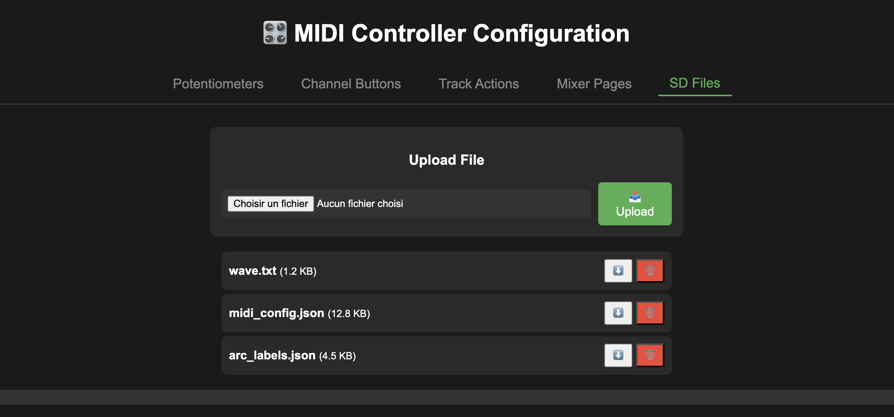
</p>

```
sd_card/
├── midi_config.json       # CC mappings, channels, notes, LFO routing
├── arc_labels.json         # Encoder labels, page names
├── mixer_config.json       # Mixer page CC/channel config
└── chord_sets.json         # 100 chord sets + types + progressions
```

**Auto-save**: configs persist to SD automatically every 30 seconds. JSON-based with binary-to-JSON migration.

---

# 🧭 Controls & Navigation

## Shift Button (Pin 12)

| Action | Result |
|---|---|
| Short Press | Momentary mixer mode |
| Hold + Tap Mixer Page | Latching mixer mode |

## LFO Button (Pin 14)

| Action | Result |
|---|---|
| Press | Toggle LFO mode |

---

# 🔌 Hardware Wiring

## AS5600 Encoder Connections

| AS5600 | TCA9548 / ESP32 |
|---|---|
| VCC | 3.3V |
| GND | GND |
| SDA | SC01Plus pin 10 |
| SCL | SC01Plus pin 11 |
| DIR | Not connected |
| OUT | Not connected |

## I2C Multiplexer Layout

- 3× TCA9548A multiplexers (20 of 24 available busses used)
- Configurable I2C pins

```
static const int PIN_TOUCH_1 = 12;
static const int PIN_TOUCH_2 = 14;
static const int PIN_SCL = 11;
static const int PIN_SDA = 10;
static const int PIN_SD_SCK = 39;
static const int PIN_SD_MISO = 38;
static const int PIN_SD_MOSI = 40;
static const int PIN_SD_CS = 41;
static const int PIN_VIBRATION_MOTOR = 13;
static const int VIBRATION_DURATION_MS = 1;
```

---

# 🔧 Customization

No recompilation required. Customize through:
- Touchscreen UI
- Web interface
- Direct SD card editing

---

# 🚀 Getting Started

## Hardware Requirements

- WT32 SC01 Plus
- 20× AS5600 encoders
- 3× TCA9548A multiplexers
- SD card

## Dependencies

| Library | Purpose |
|---|---|
| Control Surface | MIDI engine |
| LVGL | GUI rendering |
| ArduinoJson | Config parsing |
| Wire | I2C communication |
| LovyanGFX | Display driver |

---

# 📡 Bluetooth MIDI

BLE MIDI enabled by default. Tested in:
- DAWs (Ableton, Logic, Reaper)
- Mobile apps (Drambo, Gadget)
- Hardware synths

## USB MIDI

Optional — enable with `#define ENABLE_USB_MIDI` in build configuration.

---

# 🎨 UI System

Created with SquareLine Studio. Touch interaction, animated widgets, real-time updates, waveform displays, responsive layouts.

> Modifying object names or removing objects in SquareLine Studio may prevent compilation.

---

# ⚠️ Known Limitations

- Shortcut pots mirror value but not pot style when symmetrical
- Build gets messy easily

<p align="center">
  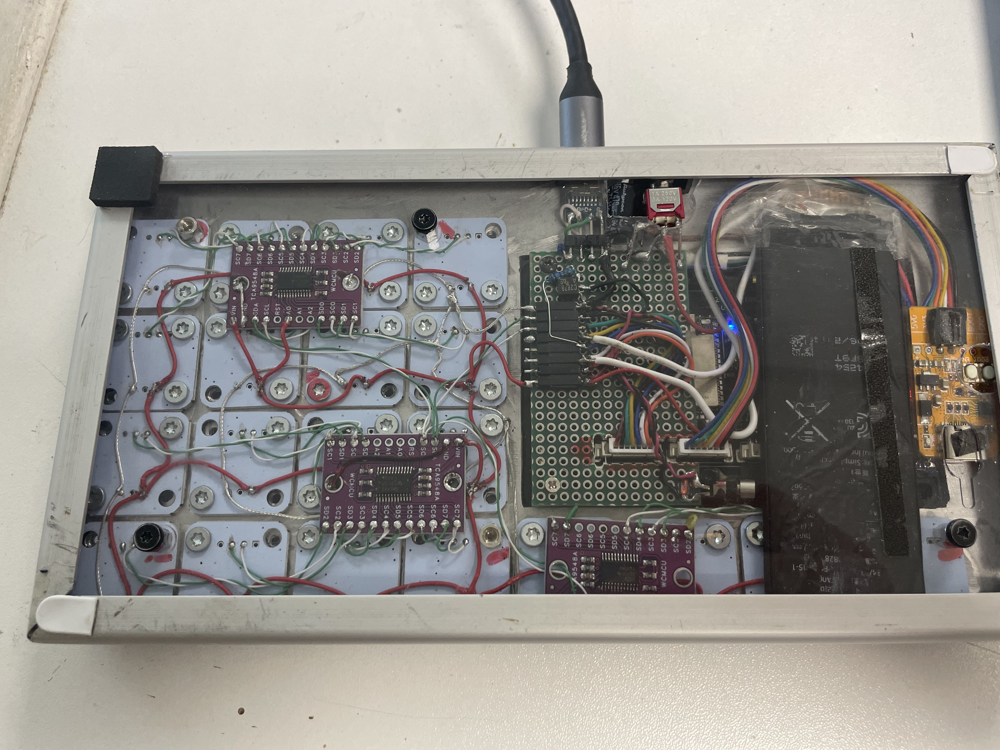
</p>

This ghetto prototype also has USB-C for firmware upload and battery charging (TP4056 + scrapped iPhone 5c battery). The vibration motor was a nice idea for haptic feedback but a quiet device is even better — might get removed.

---

# 🛠 Planned Features

- MIDI clock sync
- Additional LFO waveforms
- Program Change / SysEx support
- MIDI learn mode
- OSC support
- SD preset manager
- WS2812 LED ring support
- MPR121 / MCP23017 expander support
- Multi-device sync
- CV/Gate I/O module extension
- Complex chord mode with progressions & parallel sending
- MIDI DIN In/Out/Thru
- More embedded LFOs
- Modular menu system
- Board definitions for other hardware (Teensy, ESP32 with generic screens)
- Real PCB with LED rings for each encoder
- Make it waterproof?

---

# 🤝 Contributing

Pull requests are welcome. I'm not a coder IRL — everything in this repo is mainly (subscription free) AI slop and an insane amount of testing and debugging.

What do you use, what do you need, and what do you want? Ideas, improvements, and feature requests are encouraged.

monsieurgrosconnard(at)gmail.com

---

# 📜 License

MIT License

---

# ❤️ Credits

- LVGL
- Control Surface
- SquareLine Studio
- LovyanGFX
